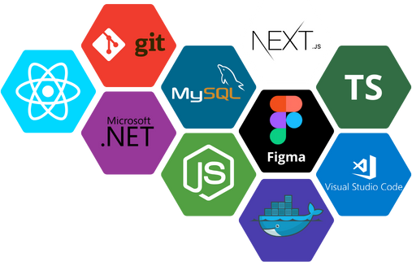

# Olá, me chamo Gabriel Rieff 

    
    

## 👦 Sobre mim 

Olá, sou Gabriel, graduando em Análise e Desenvolvimento de Sistemas, com mais de 2 anos de experiência em desenvolvimento de software.

Sou uma pessoa organizada e com habilidades interpessoais desenvolvidas, o que me permite trabalhar bem em equipe e estabelecer relacionamentos produtivos. Tenho uma forte capacidade de análise para resolver problemas e lidar com cenários críticos, sempre disposto a aprender e a colaborar. Estou constantemente em busca de entender o negócio, as necessidades dos clientes e suas dificuldades, para entregar soluções de excelência.

Atuo como desenvolvedor fullstack, utilizando uma variedade de tecnologias, incluindo HTML, CSS, JavaScript/TypeScript, React, .NET, Node.js e MySQL. Estou sempre em busca de expandir meu conhecimento sobre as tecnologias que uso e de me aprofundar em estruturas e padrões de projeto.

## ⚙️ Tach skill

    

## 💻 Principais linguagens

    

